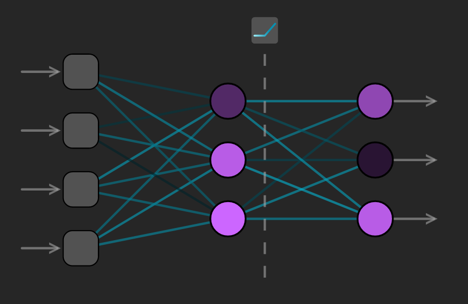
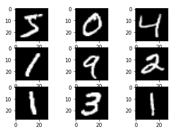
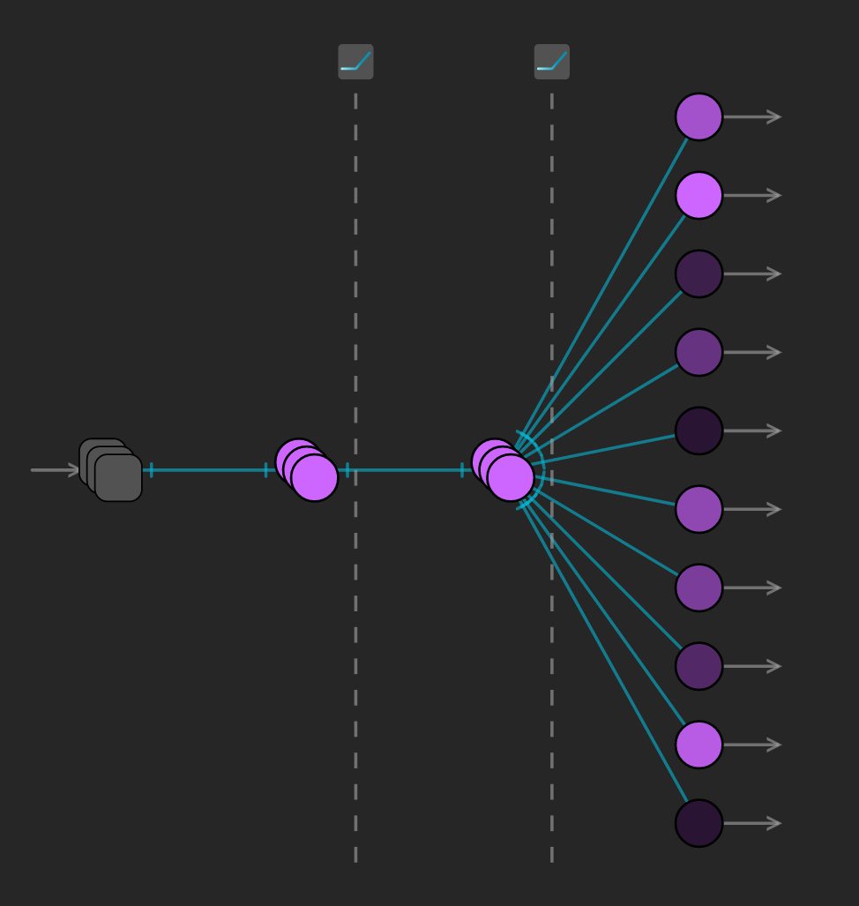

# Problem Statement

There are an increasingly large number of machine learning frameworks available that all allow their users to build and train neural networks for any purpose. Each option has its own nuances, strengths, and limitations. With so many possibilities, it is almost certain that new users will have a difficult time deciding what to use and how to use it. This project aims to summarize some of the most popular frameworks and compare and contrast how some standard neural networks can be constructed in each.

# Methodology

## Iris Example

### Dataset
The iris dataset is a common dataset used for classification problems. It contains 150 samples of 3 different species of iris flowers. Each sample has 4 features: sepal length, sepal width, petal length, and petal width. The goal is to classify each sample into one of the 3 species based on the 4 features. The full dataset is available as a module in many machine learning frameworks, or a standardized version can be found in the `standard_datasets` directory. This copy of the dataset can be found in the [UCI Machine Learning Repository](https://archive.ics.uci.edu/dataset/53/iris).

A small sample of the dataset looks like the following:
| Sepal Length | Sepal Width | Petal Length | Petal Width | Species              |
|--------------|-------------|--------------|-------------|----------------------|
| 5.1          | 3.5         | 1.4          | 0.2         | Iris-setosa          |
| 4.9          | 3.0         | 1.4          | 0.2         | Iris-setosa          |
| 7.0          | 3.2         | 4.7          | 1.4         | Iris-versicolor      |
| 6.4          | 3.2         | 4.5          | 1.5         | Iris-versicolor      |
| 6.3          | 3.3         | 6.0          | 2.5         | Iris-virginica       |
| 5.8          | 2.7         | 5.1          | 1.9         | Iris-virginica       |

### Network Structure
The network structure used for this example is a simple feed-forward network with 1 hidden layer, making 3 total layers. The input layer has 4 nodes, one for each feature in the dataset. The hidden layer has 3 nodes, and the output layer has 3 nodes, one for each species in the dataset. The network used in this example uses ReLU activations functions, a cross entropy loss function, and stochastic gradient descent as an optimizer. The network structure is visualized below.



## MNIST Example

### Dataset
The MNIST dataset is a common dataset used for image classification problems. It contains 60,000 training images and 10,000 testing images of handwritten digits. Each image is 28x28 pixels, and each pixel is represented by a value between 0 and 255. The goal is to classify each image into one of the 10 digits. The full dataset is available as a module in many machine learning frameworks, which is what was used for these examples. The original dataset can be found in the [MNIST Database](http://yann.lecun.com/exdb/mnist/).

A small sample of the dataset looks like the following:



*Image courtesy of [Digital Ocean](https://www.digitalocean.com/community/tutorials/mnist-dataset-in-python)*

### Network Structure
The network structure used for this example is a simple feed-forward network with 2 hidden layers, making 4 total layers. The input layer has 784 nodes, one for each pixel in the image. Note that the image is flattened into a 1-dimensional structure before it is inputted into the network. The hidden layers have 512 nodes each, and the output layer has 10 nodes, one for each digit. The network used in this example uses ReLU activations functions, a cross entropy loss function, and stochastic gradient descent as an optimizer. The network structure is visualized below.



## Frameworks
The following frameworks were used for this project:
- Pytorch
- Scikit-learn
- Tensorflow/Keras

# Framework Comparison Metrics
For the purposes of this project, the following metrics will be used to compare the frameworks, with a score out of 5 for each metric:
- Ease of data import <!-- (Iris examples are probably better for this since I didn't really test with MNIST) -->
- Control over network structure <!-- (I.e. Can I have different activations per layer, options for layer types like conv, etc) -->
- Loss function specification
- Optimizer specification
- Training loop customization
    - Metrics during training 
- Network evaluation

| Framework           | Score |
|---------------------|-------|
| Pytorch             | 25/30 |
| Scikit-learn        | 13/30 |
| Tensorflow/Keras    | --/30 |

# Pytorch
| Metric                         | Score |
|--------------------------------|-------|
| Ease of data import            | 4     |
| Control over network structure | 5     |
| Loss function specification    | 4     |
| Optimizer specification        | 4     |
| Training loop customization    | 5     |
| Network evaluation             | 4     |
| Total                          | 25/30 |

## Ease of data import
Pytorch has a strong internal library of popular datasets, including both the iris and MNIST datasets used in this project. Of course, these datasets are preformatted to be easy to use with Pytorch networks, which makes getting started learning the rest of Pytorch's syntax much easier. 

All of these built-in datasets are simply Python classes that inherit from Pytorch's `Dataset` class, making it extraordinarily easy to create your own dataset classes. This is integral to the ease of use of any framework as most real-world datasets will not be pre-formatted to be used with any framework.

Once the dataset is created, it is passed into a `DataLoader` class, which is used to iterate over the dataset in batches. This is a very useful class as it allows the user to specify the batch size, whether or not to shuffle the data, and whether or not to use multiple threads to load the data. This is especially useful for large datasets that may not fit in memory, as the data can be loaded in batches and then discarded after each batch is used.

For this combination of reasons, Pytorch's data import system is one of the easier ones to use, though formatting and importing data is always one of the most complicated parts of machine learning.

## Control over network structure
When specifying a network in Pytorch, the developer must create a new class that subclasses Pytorch's `nn.Module` class. This class must have a `__init__` method that defines the layers of the network, and a `forward` method that defines how the data flows through the network. Pytorch has helper classes such as the `nn.Sequential` class that make it easy to create a network with a simple structure, but it is also easy to create a network with a more complex structure by adding more complex behavior to the `forward` method. For networks like the MNIST example, the `forward` method can also contain some preprocessing steps, such as flattening the input image.

In Pytorch, layers and activation functions are separate from each other, and each need to be specified in the `__init__` function. This allows for more flexibility in the network structure, but it also means that the developer needs to be more careful when creating the network. Most common layers and activation functions are available in Pytorch's `nn` module, but it is also possible to create custom layers and activation functions by subclassing Pytorch's `nn.Module` class.

An example of a simple network structure in Pytorch is shown below:
```python
class MNISTNetwork(nn.Module):
    def __init__(self, input_size, output_size, inner_layer_size=INNER_LAYER_SIZE):
        super().__init__()
        self.flatten = nn.Flatten()
        self.linear_relu_sequential_model = nn.Sequential(
            nn.Linear(input_size, inner_layer_size),
            nn.ReLU(),
            nn.Linear(inner_layer_size, inner_layer_size),
            nn.ReLU(),
            nn.Linear(inner_layer_size, output_size)
        )

    def forward(self, x):
        x = self.flatten(x)
        logits = self.linear_relu_sequential_model(x)
        return logits
```

## Loss function and optimizer specification
Pytorch has a large number of loss functions and optimizers available in the `torch.nn` and `torch.optim` modules, respectively. The loss functions are all subclasses of Pytorch's `_Loss` class, and the optimizers are all subclasses of Pytorch's `optim.Optimizer` class. This means that it is possible to create custom loss functions and optimizers by sub-classing these classes, though this is not necessary for most use cases.

## Training loop customization
Unlike some other frameworks, Pytorch does not have a built-in training loop. This means that the developer has complete control over the training loop, which is both a strength and a weakness. It is a strength because it allows the developer to customize the training loop to their specific needs, but it is a weakness because it means that the developer needs to write more code to get a working network. Pytorch makes writing these training loops relatively easy, providing forward propagation methods though calling the network itself, backward propagation through the `backward` method of the loss function, and optimization through the `step` method of the optimizer. Because the training loop is completely custom, the developer can specify any metrics they want to keep track of during training, such as accuracy, loss, etc.

## Network evaluation
Like training, Pytorch does not have a built-in evaluation method, requiring the developer to write their own. This is not a difficult task, as Pytorch provides a `torch.no_grad` context manager that disables gradient calculation, which is not needed during evaluation. This means that the developer can use the same forward propagation method that they used during training to evaluate the network. As with during training, the developer can specify any metrics they want to keep track of during evaluation.

# Scikit-learn 
| Metric                         | Score |
|--------------------------------|-------|
| Ease of data import            | 3     |
| Control over network structure | 2     |
| Loss function specification    | 1     |
| Optimizer specification        | 3     |
| Training loop customization    | 1     |
| Network evaluation             | 3     |
| Total                          | 13/30 |

## Ease of data import
Like Pytorch, scikit-learn does have some popular datasets built into the framework, though the documentation on these is not as easy to find as Pytorch's. Once found, however, built-in datasets are relatively easy to use. 

Using custom datasets is more difficult in scikit-learn than in Pytorch. While scikit's tools for data manipulation are unmatched, the framework seems less supportive of popular data libraries such as Numpy arrays and Pandas dataframes, only really seeming to support Numpy. This means that the developer needs to convert their data into Numpy arrays before using it with scikit-learn, which is unnecessary in some other frameworks.

Luckily, once the data is imported and formatted, the fit method only requires the data and labels to be in two separate Numpy arrays, so there are plenty of options for handling the data manipulation necessary to get to that step.

## Control over network structure
As opposed to Pytorch's superb network specification structure, scikit-learn doesn't really allow developers to create fully custom networks. Instead, typical networks are created using one of a small selection of classes. For the examples in this project, scikit-learn's `MLPClassifier` class was used, which creates a feed-forward network with the specified number of hidden layers.

All of the necessary pieces for small examples like Iris and MNIST are available in scikit-learn, but the lack of flexibility in the network structure makes it difficult to create more complex networks.

An example of a simple networks structure in scikit-learn is shown below:
```python
self.model = MLPClassifier(
    hidden_layer_sizes=(inner_layer_size, inner_layer_size), 
    activation='relu', 
    solver='sgd', 
    max_iter=epochs,
    alpha=0, # Don't add regularization
    learning_rate_init=learning_rate,
    shuffle=False,
    momentum=0,
    tol=0, # Don't automatically stop upon convergence
    verbose=True
)
```

## Loss function and optimizer specification
Scikit-learn does not appear to have a way, at least with their `MLPClassifier` class, to specify a loss function. According to documentation, log loss is used for all calculations. While this is sufficient for most use-cases, not having the flexibility to specify a custom loss function is a major drawback.

Scikit-learn does have a few options for optimizers, though they are not as flexible as those in other frameworks. The `MLPClassifier` class has a `solver` parameter that allows the developer to specify the optimizer, but the options are limited to `sgd`, `adam`, and `lbfgs`. The `sgd` option was used for both examples in this project to maintain consistency across frameworks, though `adam` is the default option.

## Training loop customization
Scikit-learn's training loop is fully encompassed in the `fit` method of the `MLPClassifier` class. This means that the developer has very little control over the training loop, and cannot specify any metrics to keep track of during training. The advantage of a system such as this is that it requires little experience with training neural networks to get started, but does limit possibilities for more advanced users.

## Network evaluation
In a similar way to the integrated `fit` function, scikit-learn also has an integrated `predict` function that, in conjunction with the `metrics` module, allows the developer to create a basic evaluation procedure. The `predict` function can be run on a full Numpy array of input data, and will return a Numpy array of predictions. From there, the `accuracy_score` in the `metrics` module can be used to calculate the accuracy of the predictions. 

# Tensorflow/Keras 
| Metric                         | Score |
|--------------------------------|-------|
| Ease of data import            | -     |
| Control over network structure | -     |
| Loss function specification    | -     |
| Optimizer specification        | -     |
| Training loop customization    | -     |
| Network evaluation             | -     |
| Total                          | --/30 |

## Ease of data import
<!-- TODO -->

## Control over network structure
<!-- TODO -->

## Loss function and optimizer specification
<!-- TODO -->

## Training loop customization
<!-- TODO -->

## Network evaluation
<!-- TODO -->

# Discussion <!-- TODO: Talk about what I like and why. Maybe also what I think would be good for beginners -->